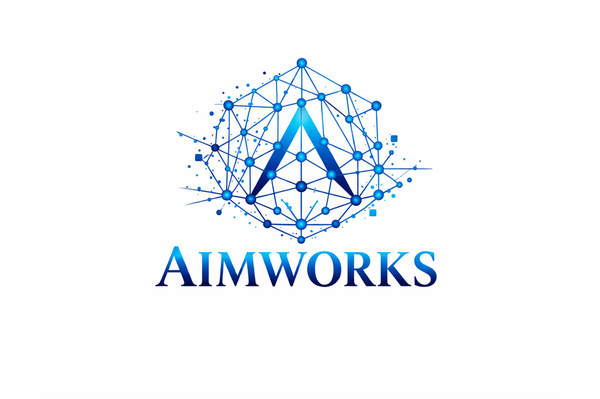

# AIMWORKS

<p align="center">
  
</p>

AIMWORKS is the source repository for the H2KG ontology engineering and publication workflow for hydrogen electrochemical systems. It combines ontology source material, release automation, standards alignment, quality control, and GitHub Pages publication for profile-specific H2KG releases.

The repository currently publishes two application profiles:

- `PEMFC`: proton exchange membrane fuel cell systems
- `PEMWE`: proton exchange membrane water electrolysis systems

## What This Repository Delivers

This repository is designed to produce a professional ontology release, not only raw RDF files. The workflow generates:

- profile-specific ontology artefacts for PEMFC and PEMWE
- split modules for schema, examples, mappings, and release views
- standards-aligned mappings to HDO, EMMO, QUDT, ChEBI, PROV-O, and DCTERMS
- validation, FAIRness, and engineering reports
- static GitHub Pages documentation and downloadable release bundles
- ODK-compatible machine-release artefacts in parallel with the AIMWORKS publication layer

## Repository Structure

| Path | Purpose |
| --- | --- |
| [`ontology_release/`](./ontology_release) | Release-engineering package, config, templates, tests, and generated outputs |
| [`ontology_release/src/aimworks_ontology_release/`](./ontology_release/src/aimworks_ontology_release) | Python implementation of the release pipeline |
| [`ontology_release/config/`](./ontology_release/config) | Release, profile, namespace, mapping, and source-ontology configuration |
| [`ontology_release/templates/`](./ontology_release/templates) | HTML and asset templates for generated documentation |
| [`ontology_release/tests/`](./ontology_release/tests) | Regression and release-pipeline tests |
| [`ontology_release/output/`](./ontology_release/output) | Generated docs, reports, release bundles, and ontology artefacts |
| [`ontology_release/odk/`](./ontology_release/odk) | Nested ODK workbench used as the machine-oriented backend |
| [`docs/`](./docs) | Repository-level guidance for maintainers and contributors |
| [`.github/workflows/`](./.github/workflows) | CI workflows for tests, release builds, GitHub Pages, and release publication |

## Working Model

The repository follows an ontology-first release model:

1. stabilize the ontology schema
2. separate schema from example and KG-like content
3. align to external standards conservatively
4. validate and document the release
5. publish profile-specific outputs

This separation is intentional. It reduces schema drift and supports interoperability, reproducibility, and stable public release artefacts.

## Quick Start

### Windows PowerShell

```powershell
cd ontology_release
python -m venv .venv
.venv\Scripts\Activate.ps1
python -m pip install -r requirements.txt
python -m pip install -e .
python -m aimworks_ontology_release.cli profiles
python -m aimworks_ontology_release.cli docs-all
```

### macOS / Linux

```bash
cd ontology_release
python -m venv .venv
source .venv/bin/activate
python -m pip install -r requirements.txt
python -m pip install -e .
python -m aimworks_ontology_release.cli profiles
python -m aimworks_ontology_release.cli docs-all
```

## Common Commands

Run these from [`ontology_release/`](./ontology_release):

| Command | Purpose |
| --- | --- |
| `python -m aimworks_ontology_release.cli profiles` | List configured ontology profiles |
| `python -m aimworks_ontology_release.cli inspect --profile pemfc` | Inspect and classify ontology terms |
| `python -m aimworks_ontology_release.cli map --profile pemfc` | Generate accepted and exploratory mapping outputs |
| `python -m aimworks_ontology_release.cli validate --profile pemfc` | Run validation and reporting |
| `python -m aimworks_ontology_release.cli docs-all` | Build GitHub Pages documentation for all profiles |
| `python -m aimworks_ontology_release.cli release-all` | Build the full release stack for all profiles |
| `python -m pytest` | Run the test suite |

## Publication

The GitHub Pages workflow publishes the generated documentation from `ontology_release/output/docs`. The release pipeline also generates:

- release-ready HTML reference pages
- RDF/JSON-LD ontology downloads
- mapping review artefacts
- import and quality dashboards
- release bundles and machine-oriented ODK artefacts

## Standards and Dependencies

H2KG is engineered conservatively and reuses external ontologies where appropriate:

- `EMMO` and electrochemistry-aligned imports for scientific and process semantics
- `HDO` for data, metadata, and digital-object concepts
- `QUDT` for quantities, units, and quantity-value structures
- `ChEBI` for chemical entities
- `PROV-O` and `DCTERMS` for provenance and release metadata

## Documentation

- Repository and maintainer guidance: [`docs/`](./docs)
- Release package details: [`ontology_release/README.md`](./ontology_release/README.md)
- Citation metadata: [`ontology_release/CITATION.cff`](./ontology_release/CITATION.cff)

## Funding and Acknowledgement

This publication is part of the DECODE project that has received funding from the European Union's Horizon Europe research and innovation programme under grant agreement No 101135537. Views and opinions expressed are however those of the author(s) only and do not necessarily reflect those of the European Union or HADEA. Neither the European Union nor the granting authority can be held responsible for them.

This work was also funded by the Helmholtz Metadata Collaboration (HMC), an incubator platform of the Helmholtz Association within its Information and Data Science strategic initiative, through the Initiative and Networking Fund (INF) - AIMWORKS (grant no. ZT-I-PF-3-099, project no. D.B.002807).

## License

The release-engineering package is distributed under the MIT License in [`ontology_release/LICENSE`](./ontology_release/LICENSE).
